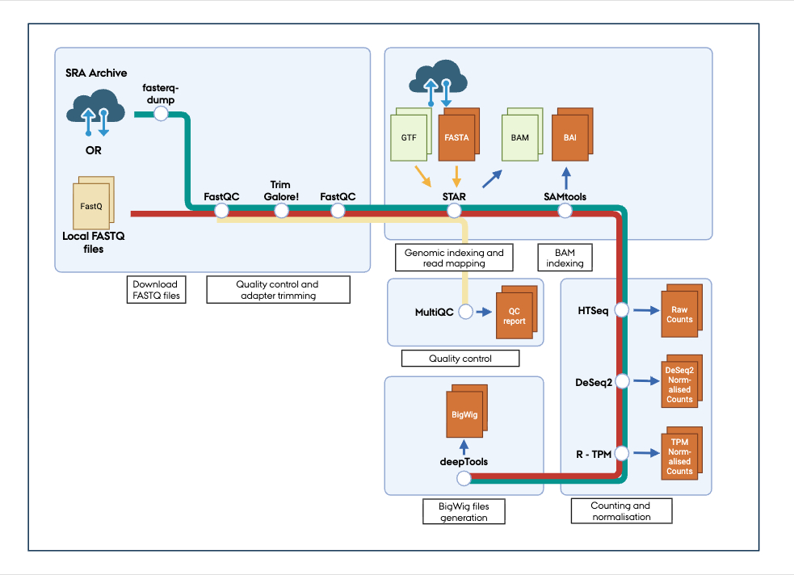
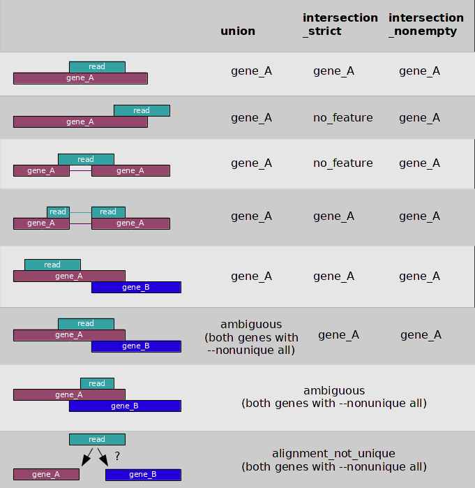

# Run-To-The-BAMs

##  - An automatic and efficient Snakemake workflow for RNA-seq data processing - 


## Version 1.2 update

- BigWig bin size selectable
- Readme updated


## Pipeline overview



The Run-To-The_BAMs pipeline automates RNA-seq data processing from raw FASTQ files to quality-checked, mapped, and normalised gene counts, along with visualisation-ready BigWig files.

In this pipeline, you either upload our own FASTQ files or select SRR IDs from the SRA Archive for analysis. The pipeline has following steps:

- Quality control (FastQC, Trim Galore!, MultiQC)
  - Output: Read and mapping quality control report
- Mapping reads to selected genome (STAR)
  - Output: BAM and BAI file
- Count reads mapped to genome (HTSeq)
  - Output: Raw gene counts in CSV format including gene id, gene name and gene biotype
- Normalise counts by DeSeq2 and TPM methods (DeSeq2, R)
  - Output: Normalised gene counts in CSV format including gene id, gene name and gene biotype
- Generate BigWig file (deepTools)
  - Output: Normalised and raw BigWig files for both plus and minus strand


## Requirements

This pipeline is designed to run on a **SLURM-based high-performance computing (HPC) cluster**.  
It uses **Snakemake** to submit and manage jobs automatically through SLURM.  

To efficiently process RNA-seq data, the HPC node should have at least **64 GB of RAM** and **16 CPU cores**, but when running several samples or workflow rules in parallel, proportionally higher resources are required.


### New to Github, command-line programs or working on a cluster?

------

##### Github

This program is a open-souce tool deposited on Github and freely available. 

To use the programm you "clone" the program from this Github repository to your computer cluster as mentioned in the installation part, and the program files are downloaded to the directory you own directory.
[To be updated, kpors 20251028]


## Installation

#### Install Run-to-the-bams package

On your HPC cluster, navigate to the directory designated for storing the pipeline files before downloading them. 

Download pipeline files:

```bash
# Go to directory for cloning Run-to-the-BAMs into
cd /home/username/projects/

# Clone Run-to-the-BAMs into the directory
git clone https://github.com/kpors/Run-to-the-BAMs
```


#### Install Conda

In this manual, we use **Conda** to manage the software environment required for running the pipeline.  
It is therefore important that you have Conda installed.  
**If Conda is not already available on your system**, you can install it by following the commands below, line by line.

##### Conda installation

```bash
wget https://github.com/conda-forge/miniforge/releases/latest/download/Miniforge3-Linux-x86_64.sh -O miniforge.sh

chmod +x miniforge.sh

bash miniforge.sh -b

./miniforge3/bin/conda init bash
```

These settings ensure that Conda installs packages from the correct bioinformatics channels with strict version control.

```bash
conda config --append channels bioconda

conda config --append channels genomedk

conda config --set channel_priority strict

conda config --set auto_activate_base false
```


#### Install Snakemake

To enable the use of Snakemake and its associated tools, install it in a Conda environment.

```bash
# Make new environement named snakemake and install snakemake packages into environment
conda create -n snakemake snakemake-executor-plugin-slurm=1.8.0 snakemake=9.13.4
```

Activate the environment 

```bash
# Activate the snakemake environment
conda activate snakemake
```


### Using the Snakemake pipeline Run-to-the-bams

------

You need to set different parameters and define FASTQ files/SRA Archive IDs before running Run-to-the-bams, this is done in the Sample_sheet.csv file found in the INPUT directory.

#### Sample sheet

##### Date & project

Fill in date for running these samples and name of project

##### Organism

Here you choose which organism the sequencing data should be mapped to:

| Pick # | Organism     | Annotation                                                   |
| ------ | ------------ | ------------------------------------------------------------ |
| 1      | Homo sapiens | Homo_sapiens.GRCh38.115.gtf<br />Homo_sapiens.GRCh38.dna.primary_assembly.fa |
| 2      | Mus musculus | Mus_musculus.GRCm39.115.gtf<br />Mus_musculus.GRCm39.dna.primary_assembly.fa |
| 3      | Other        | Write link to GTF and fasta files below <br />(https://www.ensembl.org/info/data/ftp/index.html) |

I you want to map the sequencing data to another organism then pick 3 and write link to GTF and fasta files in the boxes below in this format:

Example: https://ftp.ensembl.org/pub/current_gtf/mus_musculus/Mus_musculus.GRCm39.115.gtf.gz
Example: https://ftp.ensembl.org/pub/current_fasta/mus_musculus/dna/Mus_musculus.GRCm39.dna.primary_assembly.fa.gz

##### Sequencing type

Pick which sequencing type the sequencing library is made by:

| Pick # | Sequencing type       |
| ------ | --------------------- |
| 1      | Paired-end sequencing |
| 2      | Single end sequencing |

##### Read length

Write  which read length the reads are sequenced to.

##### Sequencing data input

Here you select if your input data are uploaded to the FASTQ input directory (Run-to-the-bams/input/fastq/) or automatically downloaded from SRA Archive:

| Pick # | Sequencing data input                                      |
| ------ | ---------------------------------------------------------- |
| 1      | Uploaded to input directory (Run-to-the-bams/input/fastq/) |
| 2      | Downloaded from SRA Archive                                |

##### Trimming parameter - Adapter detection

Reads are trimmed to remove possible remaining adapter sequences from the library preparation. In this pipeline Trim Galore! (https://github.com/FelixKrueger/TrimGalore) is used for this process, and therefore these standard adapters are automatically detected and trimmed away:

```
Illumina:   AGATCGGAAGAGC
Small RNA:  TGGAATTCTCGG
Nextera:    CTGTCTCTTATA
```

In the pipeline you can either ask Trim Galore! to auto-detect adapters or ask it to manually trim away specific adapters:

| Pick # | Adapter trimming                |
| ------ | ------------------------------- |
| 1      | Auto-detection (default choise) |
| 2      | Manual                          |

If you choose manual, please write trimming adapter sequences in the boxe(s) below.

##### Trimming parameter - Minimum read length

To avoid crashes of the mapping program, which require sequences with a certain minimum length, reads below a certain length is removed from the data set. The default setting is 25 bp.

##### Trimming parameter - Minimum base quality

Low-quality bases are trimmed off from the 3' end of the reads before adapter removal to remove poor quality portions of the reads before mapping. The default setting is a minimum Phred score at 20.

##### Mapping parameter- Multimappers

Pick if you want to allow reads to map to multiple locations on the annotated genome. Setting this to 1 only allows reads to map to the best possible location on the annotated genome, whereas setting to 2 or above allows reads to map to more locations. If multimappers are allowed the default value is 100.

##### Mapping parameter- Max mismatches

Short-read sequencing has a low error rate, but occasional base miscalls still occur. To allow reads with a number of miscalls to map to the annotated genome set this value to 2 or above, else set it to 0. Default setting is 3.

##### Counting parameters - Strandedness

For counting features this pipeline use HTSeq, and to count transcripts on both the plus and minus strand correctly, the strandedness information is needed. This is difined by the library prepartion kit. I Illuminas stranded mRNA kit read 1 maps to the minus stand and read 2 to the plus strand; this is reverse stranded.

| Pick # | Strandedness              |
| ------ | ------------------------- |
| 1      | Reverse (default setting) |
| 2      | Forward                   |
| 3      | Not stranded              |

##### Counting parameters - Alignment mode

When counting features HTSeq differentiates between reads that overlap a feature fully or partially like in the example below from the HTSeq documentation page (https://htseq.readthedocs.io/en/latest/htseqcount.html) (in pipleline --nonunique is set to all to count multimappers if selected above):



| Pick # | Alignment mode                        |
| ------ | ------------------------------------- |
| 1      | Intersection_strict (Default setting) |
| 2      | Union                                 |
| 3      | Intersection-nonempty                 |

##### BigWig - Bin size

BigWig files are typically generated by dividing the annotated genome into bins and counting the number of reads mapping to each bin. This binning step reduces the overall file size. Default setting is 5.


##### Input - Processing uploaded FASTQ files

Upload zipped FASTQ files to Run-to-the-bams/input/fastq/

Write the FASTQ file name(s) in the fastq_1 column (and fastq_2 if you have paired-end data) (Example: fastq1.fastq.gz, fastq2.fastq.gz), and write a unique sample name in the Sample_name / SRA_ID column.

##### Input - Processing FASTQ files from SRA Archive (https://www.ncbi.nlm.nih.gov/sra)

Write the SRA Archive ID in the Sample_name / SRA_ID column in the SRRXXXXXXX format

##### Save sample sheet

Save/export sample sheet as a CSV file named Sample_sheet.csv in /Run-to-the-bams/input/


#### Run the pipeline

You can test if everything is filled out properly using the --dry-run command. First go to the /Run-to-the-bams/ directory and the execute the pipeline.

Remember to add your own SLURM account insted of <my_slurm_account> in --default-resources slurm_account=<my_slurm_account>

If your computer cluster allows less than 1000 jobs, then change the number in --jobs 1000

```bash
# Go to Run-to-the-BAMs directory
cd Run-to-the-BAMs

# Activate snakemake environment
conda activate snakemake

# Run a test run
snakemake --wait-for-files --executor slurm --workflow-profile profiles/slurm --use-conda --jobs 1000 --default-resources slurm_account=<my_slurm_account> --dry-run 
```

If everything seems fine, execute the pipeline without --dry-run:

```bash
# Go to Run-to-the-BAMs directory
cd Run-to-the-BAMs

# Activate snakemake environment
conda activate snakemake

# Run a test run
snakemake --wait-for-files --executor slurm --workflow-profile profiles/slurm --use-conda --jobs unlimited slurm_account=<my_slurm_account>
```

Remember to add your SLURM account in <my_slurm_account>

After the pipeline has finished output files can be found in the output directory:
Run-to-the-bams/output/
